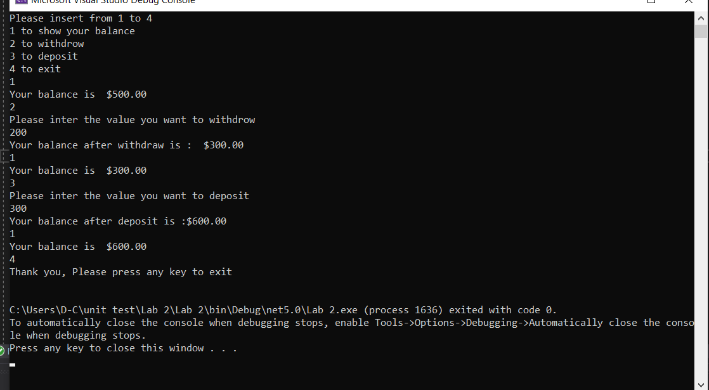
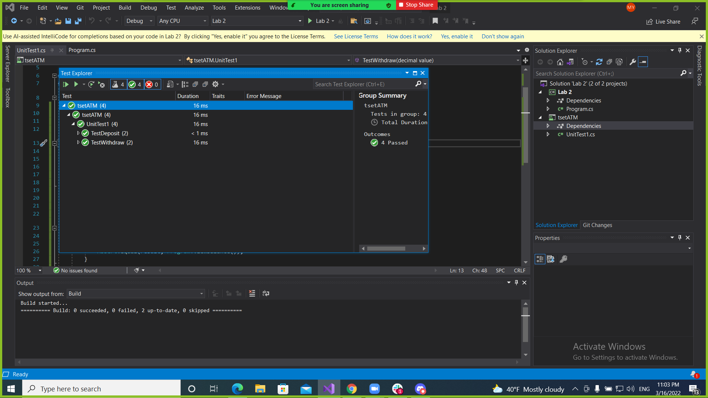

# Unit-test

## Description

It is a sample of ATM program, you can do multi deposits and withdraws
and show the balance.

---

## How to use :
1. Press 1 to show a balance
2. Press 2 to withdraw
3. Press 3 to deposit
4. press 4 to Exit

---

## Visuals

- 
- 

